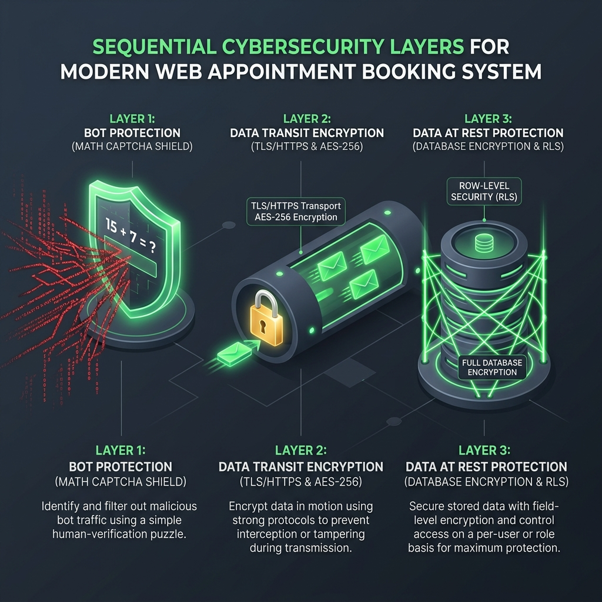

# SA Elevate — Booking Security Presentation Guide 🛡️

This document is ready for you to share with your clients or team. It explains how your appointment booking calendar is guarded against cyber threats using professional, bank-grade standards.

---

## 📊 Security Architecture Diagram

Below is the complete security pipeline designed for your platform:

*(You can also find the image file directly in your project folder as `booking_security_diagram.png`)*

---

## 🗣️ The 4 Security Shields

### 🧩 Shield 1: Math CAPTCHA (The Guard at the Gate)
*   **Purpose:** Blocks automated spam bots from flooding your calendar with hundreds of fake bookings.
*   **How it works:** It forces the visitor to solve a simple math puzzle before submitting. It runs locally and dynamically generates a new equation every time, keeping it incredibly fast for humans but impossible for standard automated script-bots.

### 🔒 Shield 2: AES-256 HTTPS (The Secure Highway)
*   **Purpose:** Protects client names, emails, and slots from being intercepted while traveling over the internet.
*   **How it works:** All data sent between the browser and our server is wrapped in an unbreakable **AES-256 cryptographic tunnel** (HTTPS/TLS). This is the exact same encryption standard used by international banks and the military to secure classified data.

### 🏛️ Shield 3: Row-Level Security & Encrypted Storage (The Vault)
*   **Purpose:** Keeps your database isolated and prevents competitors or hackers from stealing booking logs.
*   **How it works:** 
    *   **AES-256 at Rest:** Data is permanently encrypted on physical database drives.
    *   **Row-Level Security (RLS):** Database policies strictly prevent outside actors from querying, editing, or viewing any other client's booking history. Only authorized admins can see the schedule.

### 🔑 Shield 4: Secure Login Gate & Fraud-Proof Referral Program (Client Verification)
*   **Purpose:** Shuts out anonymous spam bots entirely and protects your referral rewards from malicious fraud.
*   **How it works:** 
    *   **Mandatory Authentication:** Before a user can finalize an appointment booking or access the referral program, the system securely redirects them to log in. This acts as a digital checkpoint—ensuring only registered, authenticated clients can interact with the calendar.
    *   **Fraud Prevention:** By linking bookings and referral actions to real, verified logged-in user profiles, we eliminate the risk of users claiming fraudulent rewards using fake names or temporary email accounts.
